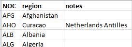
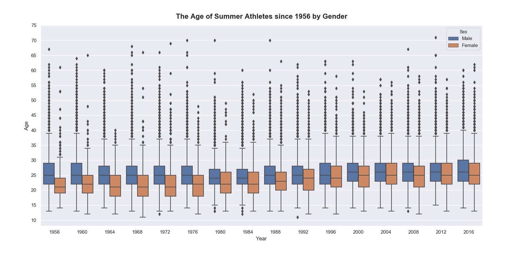
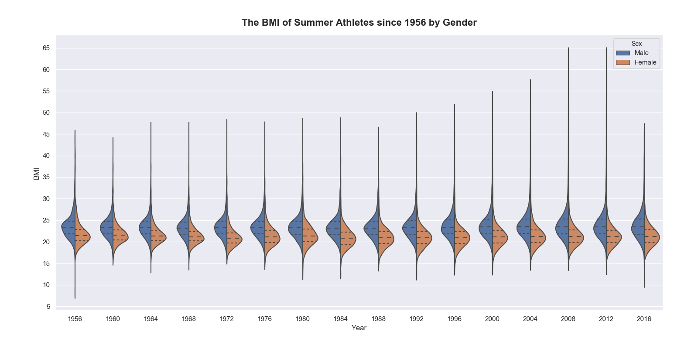
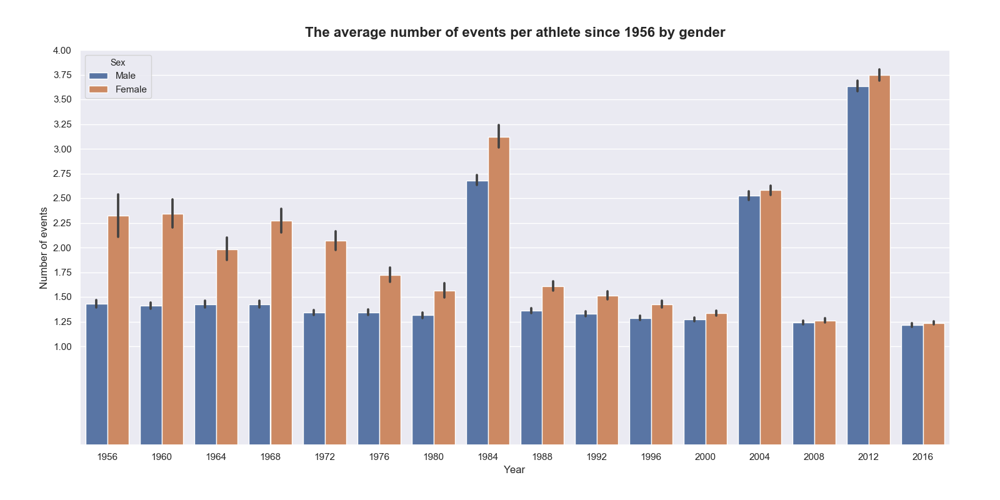
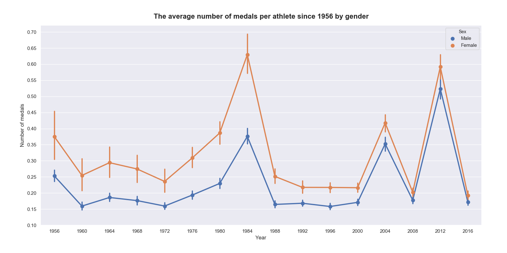
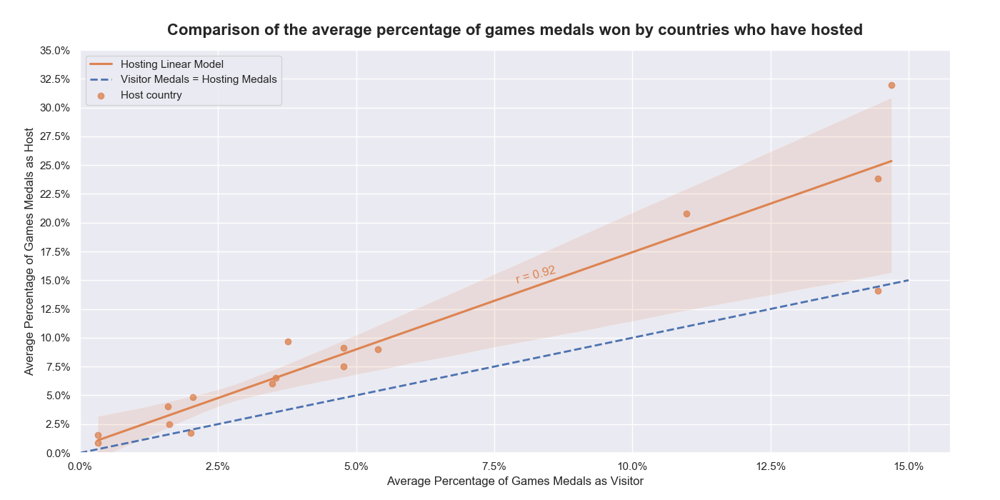

This report is about the Modern Summer Olympics from 1956 to 2016. The aim is to investigate whether there is equal distribution and provide insight into the following questions:
- Does hosting at home increase chances of a medal?
- Does countries population/GDP impact chances?
- Is there a difference in physical characteristics for medallists?
- What is the difference between men/women?
- Is Olympics fair representation of talent?
- How has the athlete changed over time?

In addition to the report a presentation was given providing an overview. 

# DATA

## DATA SOURCES
- athlete_events.csv - 120 years of Olympic history - https://www.kaggle.com/heesoo37/120-years-of-olympic-history-athletes-and-results 

- noc_regions.csv - 120 years of Olympic history - https://www.kaggle.com/heesoo37/120-years-of-olympic-history-athletes-and-results

- gdp.csv - World Bank - https://data.worldbank.org/indicator/NY.GDP.MKTP.CD 

- population.csv - World Bank - https://data.worldbank.org/indicator/NY.GDP.MKTP.CD

- host_cities.csv - Manually made from https://architectureofthegames.net/olympic-host-cities/\

## DATA PROCESSING 

### COMBINED DATASET
Start with athlete_events.csv:
1. Remove art competitions from sports
2. Remove NAME and TEAM
3. Make NOC consistent (SIN, RUS, TPE, CHN, GER, CZE, SRB)
4. Add column COUNTRY by matching with NOC in noc_regions.csv
5. Update host CITY to match common in host_cities.csv (Athens, Rome, Antwerp, Moscow, Turin, St Moritz)
6. Add column HOST_NOC by matching NOC from host_cities.csv
7. Add column BMI with weight(kg)/height^2(m)
8. Add column with Boolean whether medallist
9. Add column with GDP from gdp.csv
10. Add column POPULATION from pop.csv
11. Remove years 1896-1952
12. Remove winter season
13. Remove SEASON and GAMES columns

### TOTALS
- games_total.csv - Totals for all each attributes each year

- athlete_total.csv - Totals for each athlete (rather than each entry)

- noc_total.csv - Totals for each country each year

- host_difference.csv - The number and percentage of medals for host countries only

# DISCUSSION

## THE GAMES

## THE ATHLETES

## THE COUNTRIES

## REPRESENTATION

